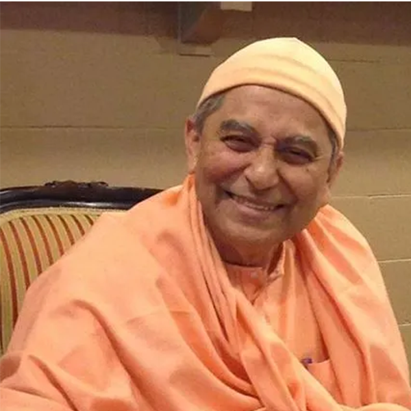
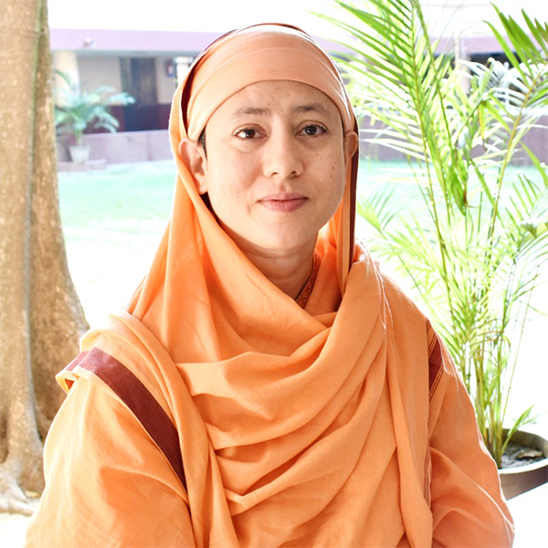
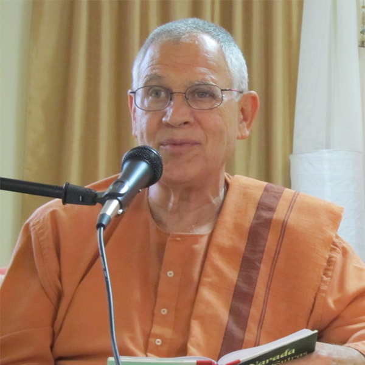
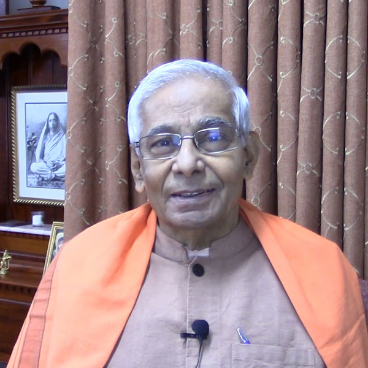
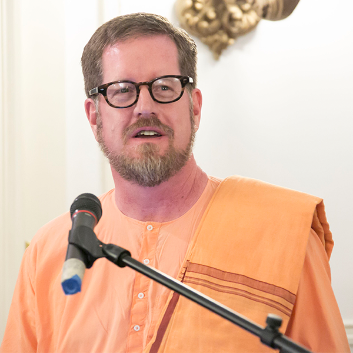

# Welcome to SciVedanta! 

SciVedanta is a collection of YouTube videos on Vedanta philosophy by several eminent monks and nuns. These YouTube videos are also converted into text for reference. 

[Vedanta](https://en.wikipedia.org/wiki/Vedanta) is the science of knowing yourself in depth. Vedanta is one of the world’s most ancient spiritual philosophies and is based on the Vedas.

Number of videos: 908

Number of words captured from videos: 8115054

# Here are some of the projects available right now:

1. [Who Am I? by Swami Sarvapriyananda](./Who_Am_I_Sarvapriyananda/)
2. [The Gospel of Sri Ramakrishna by Swami Ishatmananda](./panchamveda_ishatmananda/)
3. [The Mandukya Upanishad by Swami Sarvapriyananda](./mandukya_sarvapriyananda/)
4. [The Mandukya Upanishad by Pravrajika Divyanandaprana](./mandukya_divyanandaprana)
5. [The Bhagvad Gita by Swami Atmapriyananda](./gita_atmapriyananda/)
6. [The Bhagavatam by Swami Sarvadevananda](./bhagavatam_sarvadevananda)
7. [The Astvakra's teachings By Swami Brahmarupananda](./astvakra_teachings_brahmarupananda/)
8. [The Panchadasi by Swami Sarvapriyananda](./panchadasi_sarvapriyananda)
9. [The Four Yogas by Swami Sarvapriyananda](./four_yogas_sarvapriyananda)
10. [The Katha Upanishad by Swami Sarvapriyananda](./katha_upanishad_sarvapriyananda)
11. [The Fragrance Of Vedanta: Narada Bhakti Sutras by Swami Ishatmananda](./narada_bhakti_sutra_ishatmananda)
12. [The Mundaka Upanisad By Swami Atmajnanananda](./mundaka_upanishad_atmajnanananda)
13. [The Drg Drsya Viveka by Swami Sarvapriyananda](./drg_drsya_viveka_sarvapriyananda)
14. [The Bhagvad Gita by Swami Sarvapriyananda](./gita_sarvapriyananda)
15. [The Shanti Gita by Swami Sarvadevananda](./shanti_gita_sarvadevananda)
16. [Ask Swami Q&A by Swami Sarvapriyananda](./ask_swami_sarvapriyananda)
17. [The Vedic Christianity By Swami Chidbrahmananda](./vedic_christianity_chidbrahmananda)
18. [The Gospel of Sri Ramakrishna by Swami Atmajnanananda](./gospel_ramakrishna_atmajnanananda)

# Click on the image of a monk/nun for more details about them/their lectures:

   
   
   
   
   
   
   

Note: the video to text conversion is not 100 % accurate, especially when Hindi/Sanskrit/Bengali etc., word are pronounced. 
We plan to proof-read the texts soon. 
This project is still work in progress. If you are willing to contribute to this project by editing/proof-reading or have any questions/suggestions, 
please feel free to let us know by opening an issue [here](https://github.com/SciVedanta/SciVedanta.github.io/issues/new). If you want to learn about GitHub (great platform to collaborate), checkout this [link](https://egghead.io/courses/how-to-contribute-to-an-open-source-project-on-github).
